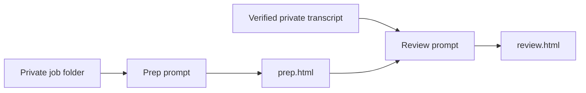

# Workflow

```mermaid
flowchart LR
  Job["Private job folder"] --> Prep["Prep prompt"]
  Prep --> PrepHtml["prep.html"]
  Transcript["Verified private transcript"] --> Review["Review prompt"]
  PrepHtml --> Review
  Review --> ReviewHtml["review.html"]
```

All generated artifacts stay in the private job folder by default.
